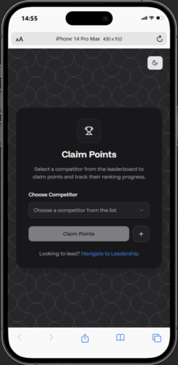
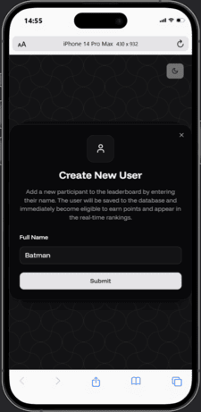
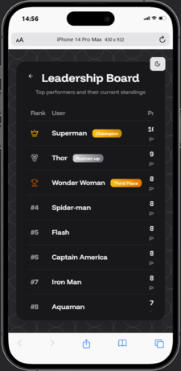

# 🏆 Leaderboard System

A full-stack real-time leaderboard application that allows users to earn random points and get ranked dynamically based on their accumulated score. Built with Node.js (Express) on the backend and React.js on the frontend. Designed for performance, modularity, and real-time responsiveness.

## 📸 Screenshots

## 📌 Features (Core Features)

**User Management**

- View a list of users (default 10)
- Add new users from the frontend
- All users stored in a MongoDB collection

**Claim Points**

- Select a user and claim random points (1–10)
- Updates total points in real-time
- Points stored and tracked in a history collection

**Leaderboard**

- Displays ranks, names, and total points
- Real-time updates after each point claim
- Auto-sorted by total points descending

**History Tracking**

- Each point claim is stored in a separate history collection
- Useful for audits, analytics, or activity logs

## 🧠 Tech Stack

- **Frontend** - _React.js + Typescript_
- **Backend** - _Node.js + Express.js + Typescript_
- **Database** - _MongoDB + Mongoose_

## ⚙️ Installation

- [Frontend (client)](https://github.com/MohammadAsad-Weber/rank-rush/tree/main/client#%EF%B8%8F-getting-started)
- [Backend (server)](https://github.com/MohammadAsad-Weber/rank-rush/tree/main/server#%EF%B8%8F-getting-started)

## 🤝 Contributing

If you would like to contribute to this project, feel free to fork the repository, make changes, and create a pull request. Please ensure your changes are well-documented and tested.

## 📬 Contact

For any questions or issues, feel free to reach out via the GitHub issues section or contact me directly through my GitHub profile.

- **Github**: [@MohammadAsad-Weber](https://github.com/MohammadAsad-Weber)
